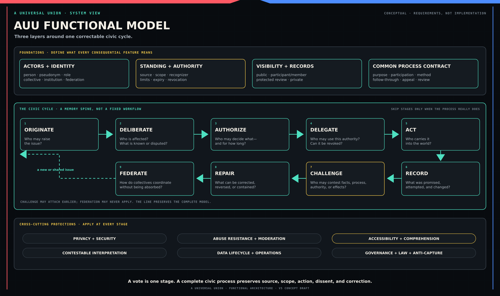

# A Universal Union v5: Reader's Map

**Status:** Conceptual and architectural draft published for independent review.

**Current phase:** External review and recruitment. AUU needs people to inspect the proposal—not endorse it. Choose a bounded route in [Review A Universal Union](./REVIEW.md).

**Start here:** This file gives the whole model before the longer documents add detail.

## The shortest accurate description

A Universal Union (AUU) is a plan for shared civic tools. The tools would help people and groups raise problems, think together, make decisions, authorize action, see what happened, challenge failure, and keep what they learned.

AUU would not be a political party, world government, or authority that tells everyone what to believe. It would also do more than host discussion or voting. Its purpose is to connect work now scattered across social media, petitions, meetings, elections, organizations, spreadsheets, public records, and protests.

People will not all agree or organize in the same way. Different communities may use different rules and institutions. But anyone who claims authority must show where it came from, what it covers, when it ends, and how it can be challenged.

No production system exists yet. These documents describe the plan, its ethical limits, and the research needed to learn what can be built safely.

For the structural problem that led to this proposal, open the zoomable diagnostic: [*The Political Insanity Loop: From Public Opinion to Civic Agency*](./docs/diagrams/from-public-opinion-to-civic-agency.svg).

## The model in one line

**Originate → deliberate → authorize → delegate → act → record → challenge → repair → federate.**

This is a memory aid, not a fixed workflow. A casual discussion may stop before a decision. A person may act without a delegate. A local group may never join a federation. The line shows the full path from a concern to group action that can be checked and corrected.

*Conceptual model. It describes intended civic relationships, not a production system or demonstrated capability.*

| Stage | Plain question | Typical result |
| --- | --- | --- |
| Originate | Who can raise the issue? | A question, concern, proposal, complaint, or challenge enters a relevant space. |
| Deliberate | Who is affected, what is known, and what are the serious objections? | Claims, evidence, testimony, alternatives, amendments, and unresolved disagreements become easier to inspect. |
| Authorize | Who may decide what, under which rule, and for how long? | A poll, vote, consent process, office decision, or other limited mandate. |
| Delegate | May someone else use that authority, and can it be revoked? | A person, role, office, or group receives a defined task or decision power. |
| Act | Who is responsible for carrying the decision into the world? | An authorized person or body attempts the work. |
| Record | What was promised, attempted, changed, and completed? | A record connects the decision to evidence about follow-through. |
| Challenge | Who may contest the facts, process, authority, or effects? | An objection receives a status, response duty, review path, and place in the record. |
| Repair | Can mistakes, harms, rules, or failed decisions be corrected? | Appeal, amendment, reversal, containment, restitution, or another defined response. |
| Federate | Can groups coordinate without surrendering all local control? | Shared action across collectives under explicit recognition, representation, dissent, and exit rules. |

## Eight questions that expose a missing piece

When evaluating any AUU process—or any proposed political solution—ask:

1. Can an ordinary person start an issue, or must an institution place it on the agenda?
2. Can the process show who is affected, including people who are absent or unsafe to appear?
3. Can participants test evidence and objections before being forced into a final choice?
4. Can they authorize a limited mandate that says who may do what, where, and for how long?
5. Can they delegate action and revoke that authority without surrendering permanent control?
6. Can they see what actually happened after the decision left the platform?
7. Can they challenge failure and pursue repair without destroying the whole system?
8. Can local groups coordinate across shared problems without being absorbed by a new center?

AUU does not claim to know the right answer for everyone. It begins with a common failure: people often have no shared path for answering all eight questions together.

## A short example

Suppose residents identify a dangerous intersection.

One resident opens the issue. Nearby residents, disabled pedestrians, cyclists, drivers, emergency workers, city staff, and people who avoid the intersection may have different forms of knowledge or standing. They add testimony, collision data, costs, objections, and possible designs. A summary shows both agreement and unresolved disputes without replacing the underlying discussion.

The relevant body then uses its published rule to authorize a limited action. That may be a neighborhood recommendation, a budget request, or—if a lawful city body is participating—a binding municipal decision. AUU does not turn the neighborhood's preference into city authority by itself. The source and limit of each claim remain attached to it.

A named office or delegate receives responsibility for the next step. Later records show whether a study was ordered, money was assigned, construction occurred, costs changed, or the action stalled. Anyone with the required standing can challenge misleading evidence, an unfair process, authority that exceeded its limit, or a result that harmed people the proposal missed. The process may then be corrected, appealed, reopened, or used as evidence by other neighborhoods facing the same problem.

The value is not the vote alone. It is the recoverable path from concern to reasoning, authority, action, evidence, challenge, and learning.

## Five distinctions to keep in mind

### 1. A person is not one permanent public identity

AUU separates the human participant, eligibility proofs, public or private pseudonyms, and temporary names shown inside a discussion. That separation may reduce exposure, but it cannot guarantee anonymity against every observer. Network data, writing style, device compromise, credential issuers, insiders, and outside records can still connect identities.

### 2. Speech is not authority

Anyone may make a personal argument. Stronger claims require stronger support. “I oppose this” is ordinary speech. “Our members voted to oppose this” requires a membership boundary, a decision rule, and a record. “We speak for this neighborhood” additionally requires a basis for representation that others can inspect and challenge.

The platform records those claims and their support. It does not make a claim true or legitimate merely by hosting it.

### 3. Standing is not one permission

Different relationships create different rights inside a process. A member may vote. An affected non-member may have a right to be heard or to challenge. An expert may submit evidence without receiving decision power. An advocate may speak about an absent group without claiming a mandate from it. A delegate may use only the authority actually granted.

### 4. Privacy is not the same as hidden power

People may need protected identities, secret ballots, sealed membership lists, or restricted evidence. Authority still needs review. Depending on risk, that review may be public, limited to participants, or performed by protected independent reviewers. A private planning conversation may remain private, but it cannot by itself prove an external mandate.

### 5. A record is not an interpretation

A record preserves what was submitted, decided, or done. A summary, classification, chart, warning, or artificial-intelligence output interprets that record. Interpretations can help people manage complexity, but they must remain correctable and linked to their sources. A summary is not the discussion. A warning is not a verdict. A cluster is not a community.

## Where authority can come from

AUU needs to represent several possible sources of authority without pretending they are interchangeable:

- a person's direct consent or authority over their own action and information;
- a member decision under a group's published rules;
- a limited delegation;
- an office, charter, contract, or law outside AUU;
- a decision process recognized by the institution or people it is meant to bind;
- recognition by another collective or federation; or
- another source that the affected process explicitly accepts.

Credentials may help prove eligibility under one of those rules. A credential does not create authority by itself.

Every authority claim should name its source, scope, permitted action, affected people, expiry or review point, and challenge path. Software can check whether a published rule was followed. It cannot settle every moral, legal, or political dispute about whether the rule deserves recognition.

## How records can be visible

The phrase *auditable* is not enough by itself. AUU uses four basic visibility modes:

- **Public:** anyone may inspect the permitted record.
- **Participant- or member-visible:** only the defined participants or members may inspect it.
- **Protected review:** authorized reviewers may inspect protected evidence under stated safeguards; others receive only permitted metadata or findings.
- **Private:** the material supports personal or internal preparation and does not by itself justify an external claim of authority.

Dangerous or unlawful material does not become safe to publish because it is evidence. A process may preserve a restricted record that something was removed, reviewed, or referred without redistributing personal data, doxxing, intimate material, credible threats, or other harmful content.

## Visual guides

Only the compact functional model is embedded on this page. The larger diagrams are placed with the documents they explain and can also be opened directly:

- [From public opinion to civic agency](./docs/diagrams/from-public-opinion-to-civic-agency.svg) — the comprehensive political diagnostic.
- [AUU logical architecture](./docs/diagrams/auu-logical-architecture.svg) — participant control, civic services, stable contracts, evidence, and replaceable systems.
- [One issue as a user experience](./docs/diagrams/auu-issue-experience.svg) — status, process, authority, visibility, explanation, action, and challenge.
- [Diagram index and maintenance notes](./docs/diagrams/README.md) — purpose, placement, accessibility, and terminology guidance.

## Reading order

| File | Read it to understand |
| --- | --- |
| [`0.mission-statement.md`](./v5-documents/0.mission-statement.md) | Why AUU is being proposed and why an ordinary person's contribution matters. |
| [`1.ethical-discussion.md`](./v5-documents/1.ethical-discussion.md) | The values and tensions that constrain the design. |
| [`2.feature-sets.md`](./v5-documents/2.feature-sets.md) | The functional system and the dependencies among its parts. |
| [`4.social-structures.md`](./v5-documents/4.social-structures.md) | How real associations and institutions are represented without manufacturing legitimacy. |
| [`6.user-experience.md`](./v5-documents/6.user-experience.md) | What a person must understand and be able to do at each stage. |
| [`3.research-and-development-strategy.md`](./v5-documents/3.research-and-development-strategy.md) | How open questions become evidence, specifications, prototypes, pilots, and adoption gates. |
| [`5.research.md`](./v5-documents/5.research.md) | How evidence is classified, bounded, reviewed, and connected to open questions. |
| [`7.tool-comparison.md`](./v5-documents/7.tool-comparison.md) | What existing tools already do, what AUU may reuse, and what remains distinct or unproven. |
| [`GLOSSARY.md`](./v5-documents/GLOSSARY.md) | The controlled meaning of terms shared across the set. |

## The present boundary

These documents can define commitments and requirements. They cannot prove that the privacy, voting, identity, governance, moderation, or federation designs are feasible or safe. Those claims require research, implementation, adversarial testing, accessibility testing, legal review, and limited pilots.

The intended destination is not a perfect ruler. It is a correctable way for people to rule together—without making any institution the only court allowed to hear its own appeal.

## Review, contribute, and discuss

You do not need to agree with AUU, read the entire repository, or have a GitHub account to participate.

| What you want to do | How to do it |
| --- | --- |
| Review the proposal | Choose a bounded route in [Review A Universal Union](./REVIEW.md). If someone invited you by email, reply directly with your notes. Otherwise, share them in the [AUU Discord](https://discord.gg/5dsAEVt4Zy). No special format is required. |
| Ask a question or discuss an early idea | Reply to the person who invited you or use the [AUU Discord](https://discord.gg/5dsAEVt4Zy). |
| Suggest a correction or concrete change | Send the proposed wording or file by email reply or through Discord. Read [how to contribute](./CONTRIBUTING.md) for guidance on making the change understandable and reviewable. |
| Create a durable public record through GitHub | If you already have a GitHub account, use the optional [Review feedback form](https://github.com/A-Universal-Union/auu-project-docs/issues/new?template=review-feedback.yml), open a [general issue](https://github.com/A-Universal-Union/auu-project-docs/issues/new), or submit a pull request. |

Feedback sent by email or Discord is not automatically copied into the public repository. If it should become part of the durable project record, AUU will ask whether it may be quoted, summarized, and attributed before transferring it. A reviewer may ask to remain unnamed.

Do not send private information, credentials, protected records, exploit instructions, or material you do not have permission to share. If you are unsure where something belongs, reply to the invitation or ask in Discord.
