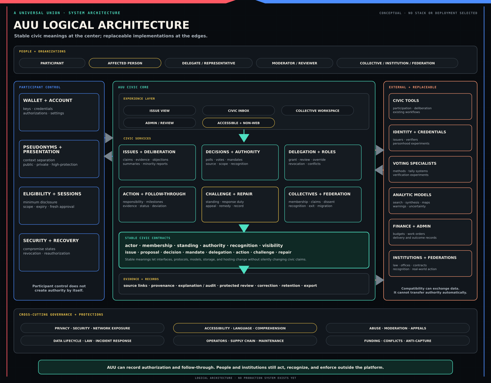

# A Universal Union: Feature Sets

**Status:** Functional architecture; not a technical specification or claim of feasibility

**Primary readers:** Civic, governance, product, security, privacy, accessibility, and software contributors

## 1. Purpose and reading rules

This document defines what A Universal Union must be capable of doing, why those capabilities matter, and which capabilities depend on others. It does not select cryptography, databases, network protocols, artificial-intelligence models, user interfaces, or voting systems. Candidate mechanisms remain subject to the [Research and Development Strategy](./3.research-and-development-strategy.md).

The words below are deliberate:

- **must** marks a functional requirement for an AUU-conforming design;
- **should** marks a strong design preference whose exceptions require explanation;
- **may** marks an optional or context-dependent capability; and
- **candidate** marks an unproven approach that requires research and testing.

A requirement is not evidence that the requirement can already be met. Privacy, security, voting, identity, analytics, and federation claims need explicit threat models and maturity labels before deployment.

Shared terms have one controlling meaning in the [Glossary](./GLOSSARY.md). The [Reader's Map](../README.md) gives the complete civic sequence in plain language.

## 2. The functional model

The system is easier to understand as three layers around one civic cycle.

### 2.1 Foundations

Before a consequential process begins, AUU must be able to answer:

- Which actor is taking part: a person, pseudonym, role, collective, office, institution, or federation?
- What relationship gives that actor standing or authority in this process?
- What is the scope and limit of the authority?
- Which information is public, participant- or member-visible, available only through protected review, or private?
- What record and challenge path will the process create?

These are not administrative details added after the feature is designed. They determine what the feature means.

### 2.2 Civic cycle

The core lifecycle is:

**Originate → deliberate → authorize → delegate → act → record → challenge → repair → federate.**

Not every process uses every stage. The sequence exists so features do not become isolated tools. A vote needs a source of authority, a record, and a correction path. A public claim needs the process that authorized it. A delegation needs scope and revocation. A record of action needs a way to contest misleading follow-through.

### 2.3 Cross-cutting protections

Privacy, security, abuse resistance, accessibility, interpretation, data lifecycle, and operational governance apply across the whole cycle. They are not separate modules that can be added after identity, voting, or records are complete.

### 2.4 Dependency map

| Capability | Depends on | It must exist before… |
| --- | --- | --- |
| Actor and identity model | Defined actor types; wallet and account boundaries. | Eligibility, voting, delegation, protected participation, or federation claims. |
| Visibility and record model | Public, participant- or member-visible, protected review, and private access rules. | Any claim described as transparent, public, reviewable, or auditable. |
| Standing and authority model | Named sources, scopes, recognizers, limits, and expiry. | Formal decisions, roles, representation, delegation, or collective voting power. |
| Deliberation and challenge | Participation lanes, evidence, summary correction, lifecycle, and anti-flooding. | A decision can claim that serious objections were available to participants. |
| Decision model | Eligibility, authority, privacy, method, closure, and record rules. | Polls or votes can be treated as mandates. |
| Delegation model | Authority scope, review, revocation, conflict handling, and coercion analysis. | Another actor can use a participant's civic power. |
| Follow-through and repair | Responsible actor, evidence expectations, challenge, appeal, and review dates. | AUU can claim to connect a decision to real-world action. |
| Collective configuration | Membership, consent, roles, claims, privacy, records, and external recognition. | Collectives can claim representation or join federations. |
| Federation model | Collective authority, recognition, dissent, exit, and interoperability rules. | Local authority can coordinate across collectives. |
| Analytics | Source records, privacy thresholds, correction, uncertainty, and contestability. | Summaries, maps, clusters, rankings, or warnings influence a consequential process. |

### 2.5 Logical architecture

The civic model should remain stable while particular software, services, and institutional integrations change. The diagram below separates participant-controlled functions, the AUU civic core, shared contracts and records, and replaceable external systems. It is a logical model, not a selected implementation stack.

## 3. The common process contract

Any process that may create authority or materially affect participation must publish a readable process summary. The exact fields vary by context, but the model must support:

| Field | Question answered |
| --- | --- |
| Purpose | What is the process trying to do? |
| Owner | Who opened or administers it, and under what role? |
| Scope | Which issue, place, collective, people, time, or action does it cover? |
| Participation | Who may observe, speak, submit evidence, challenge, vote, administer, or appeal? |
| Eligibility | Which conditions apply and who or what verifies them? |
| Authority source | What gives the outcome any decision or representative force? |
| Method | How are proposals formed, amended, decided, counted, or approved? |
| Visibility | Which material is public, participant- or member-visible, protected review, or private? |
| Records | What is preserved, for how long, with which access and safety exceptions? |
| Challenge and appeal | What may be contested, by whom, under which lifecycle and deadline? |
| Follow-through | Who must act afterward, what evidence or update is expected, and when? |
| Expiry and reconsideration | When does the authority end, and what can reopen the result? |

A private drafting process may use a lighter summary. A process cannot ask outsiders to accept an authority-bearing claim while keeping the basis of that claim undefined.

## 4. Actors, identity, trust, reputation, and standing

### 4.1 Actor types

AUU must distinguish at least:

- a human participant;
- a wallet or account controlled by a participant;
- a pseudonym used in a particular context;
- a temporary presentation identity shown inside a discussion;
- a role or office carrying defined permissions or authority;
- a collective through which a group or institution acts;
- an institutional account marked as non-human; and
- a federation of collectives.

These types must not impersonate one another. An institution must not appear as an ordinary person. A software agent must be identified as an automated actor. A discussion alias must not silently become a public delegation identity. A legal or social office must not gain platform permissions merely because the title was entered into a profile.

### 4.2 Identity wallet and bounded personhood

The participant's wallet is the control point for keys, credentials, pseudonyms, sessions, recovery methods, and authorizations. It is not primarily a public profile and need not be financial.

AUU requires a way to resist one actor pretending to be many where artificial participation would distort a process. The documents call this bounded **personhood** or uniqueness. It is a technical and procedural requirement for a stated context, not proof of legal identity or human essence.

No biometric, witness network, credential issuer, device, or account provider should be treated as permanently sufficient on its own. Candidate personhood methods must be compared for duplicate resistance, exclusion, spoofing, collusion, coercion, recovery, accessibility, jurisdiction, and privacy. Low-stakes discussion may require less assurance than a binding vote.

### 4.3 Pseudonyms and presentation identities

The wallet must support context separation. A participant may use:

| Identity mode | Typical use | Main caution |
| --- | --- | --- |
| Private or context-specific pseudonym | Ordinary civic participation without a universal public profile. | Timing, writing style, social links, devices, issuers, and outside data may still connect contexts. |
| Public or accountable pseudonym | Delegation, public representation, office, or sustained contribution where reviewability matters. | Public reputation must remain scoped and must not expose unrelated identities. |
| High-protection pseudonym | Whistleblowing, dissident activity, abuse-related participation, or another sensitive context. | Less social linkage may also mean less ordinary trust or eligibility evidence; protection is never absolute. |
| Temporary discussion identity | A random or neutral name displayed inside one deliberation. | Hiding cues can reduce some bias but can also hide expertise, history, cultural context, and relationship. It must be configurable and tested, not assumed universally beneficial. |

Wallet-level pseudonyms and discussion-layer presentation identities are different controls. A temporary display name can hide reputation from other participants while the process still enforces one eligible participant, rate limits, and moderation rules behind the scenes.

### 4.4 Eligibility with minimum disclosure

A process may need proof of membership, residency, age, employment, office, credential, affected status, or another condition. The system must reveal only the result and evidence required for the current rule where feasible.

The ordinary interaction should answer: eligible, ineligible, expired, missing requirement, or action required. It should not display a readable inventory of sensitive affiliations. A resident should not have to publish an address to prove residence. A worker should not have to expose employment to every observer. A sealed-roster member should not have to reveal membership merely to satisfy a process rule.

Every eligibility check must identify the issuer or basis, verifier, scope, expiry, revocation behavior, duplicate-use rule, audit metadata, and challenge path. Privacy-preserving credentials and zero-knowledge proofs are candidates, not assumed solutions. Issuers, live revocation checks, devices, and network traffic can still create identity bridges.

### 4.5 Trust, reputation, and standing

AUU must keep three questions separate:

| Question | Meaning | It must not become |
| --- | --- | --- |
| Is the participation grounded? | Whether the actor appears to be a real and appropriately unique participant under the process rule. | A judgment of virtue or expertise. |
| What history is relevant? | Contextual records of conduct, contributions, warnings, corrections, and fulfilled or failed obligations. | One permanent score of human worth. |
| What relationship matters here? | Whether the actor is a member, affected person, resident, witness, expert, observer, delegate, representative, or another scoped participant. | Automatic decision authority. |

A trust graph—a network of human-recognition or attestation relationships—is one candidate for grounding and manipulation analysis. It is not a settled foundation. Unlimited attestations can manufacture density; strict caps can disadvantage large-community organizers; social graphs can expose association; and mutual recognition is not the same as a unilateral claim. Any graph design needs consent rules, scope, weighting, expiry, appeals, distributional analysis, and privacy testing.

Reputation must be event-based and contextual. A contribution, warning, moderation finding, correction, missed duty, or repaired harm should say what happened, where, under which process, who issued the record, whether it is disputed, and how long it remains relevant. A housing record does not automatically define a person's credibility in medicine. A warning is not a verdict.

Standing must be qualified by action. A non-member may lack a vote while retaining standing to submit evidence or challenge consequences. An expert may advise without deciding. An affected person may need to be heard even if they cannot safely create an account. The system must not make prior participation a condition for being affected.

### 4.6 Security, sessions, compromise, and recovery

Wallet access, pseudonym access, and authorization of a sensitive action must be separable. Unlocking one device must not automatically grant equal control over every identity and role.

The security model must support stronger controls where exposure or authority is higher: device approval, passkeys, hardware keys, fresh confirmation, delays, multiple approvals, or other candidate methods. More friction is not automatically safer. Controls must be understandable, accessible, recoverable, and proportionate to the threat.

Cross-device use should allow a wallet device to authorize a limited desktop or web session for a named pseudonym and purpose. Sessions need visible scope, expiry, revocation, and fresh approval for actions such as voting, changing delegation, revealing a credential, altering recovery, or exercising an authority-bearing role.

Recovery must distinguish at least active, suspended, suspected compromise, confirmed compromise, recovery in progress, recovered control, revoked, voluntarily retired, and disputed. A recovered participant may prove eligibility again through the underlying wallet or credential. Authority-bearing roles, delegations, and institutional control must not silently transfer to a successor pseudonym; the authority source must reauthorize them.

Recovery changes future control. It does not erase prior civic records. The model must resist both hostile takeover and false compromise claims used to escape accountability.

### 4.7 Privacy claims and network exposure

AUU must describe privacy against named observers. Public pseudonym separation, operator data minimization, issuer unlinkability, ballot secrecy, roster protection, network-traffic privacy, and device security are different properties.

Sensitive participation may be exposed through internet addresses, Domain Name System requests, timing, logs, notifications, traffic volume, repeated connections, device compromise, insiders, social relationships, writing style, and external datasets. The system should minimize metadata, use conservative logging, make notification behavior privacy-aware, and support stronger routing where justified. It must also warn when the user's network or device conditions defeat an intended protection.

No interface may promise anonymity merely because names or credentials are hidden. Candidate privacy networks, delayed or batched submission, cover traffic, mesh networks, and decentralized routing each reduce different risks and introduce others.

## 5. Origination, deliberation, and challenge

### 5.1 Starting and developing an issue

An individual must be able to raise a concern, question, proposal, complaint, or challenge without first forming a collective. The action begins as personal speech. It acquires collective authority only through an accepted collective or institutional process.

An issue may move through the following states:

| State | Purpose |
| --- | --- |
| Exploration | Ask questions, gather testimony, define terms, and discover who is affected. |
| Proposal formation | Draft options, identify assumptions, add evidence, revise language, and attach predicted effects. |
| Readiness review | Test whether material objections, rights concerns, implementation questions, and eligibility rules are clear enough for a poll or vote. |
| Decision-linked deliberation | Preserve the reasoning environment directly connected to a formal process. |
| Follow-through review | Compare what was authorized with what happened. |
| Reconsideration | Reopen the issue under a stated trigger such as new evidence, procedural failure, or harmful results. |

The system must show when a discussion changes status. An exploratory conversation must not be mistaken for a mandate.

### 5.2 Participation lanes

One undifferentiated comment stream cannot express every civic role. A process may give different rights to members, affected people, witnesses, experts, observers, challengers, moderators, and decision-makers.

The required capability is to separate these rights and show them clearly. A collective might use a member deliberation area plus a distinct public challenge area. Another process might use one shared discussion with standing labels and rate limits. A separate challenge lane is optional; a meaningful challenge capability for an authority-bearing claim is not.

Private strategy and member-only preparation can be legitimate, especially for workers, dissidents, vulnerable groups, legal preparation, care matters, and safety planning. Private preparation must not be presented as proof of an external mandate. When a decision claims authority over others, the permitted record must expose or protectively review enough process to examine that claim.

### 5.3 Structure for reasoning

Deliberation must support more than chronological replies. Depending on the issue, participants need to be able to mark:

- the claim being made;
- reasons and evidence;
- definitions and assumptions;
- direct experience or affected-person testimony;
- factual corrections;
- value conflicts;
- alternatives and amendments;
- implementation requirements;
- risks and expected effects;
- serious objections; and
- unresolved questions or minority reports.

Threading, argument maps, classification, proposal histories, and linked evidence are possible interface forms. Ordinary participation must remain low-friction; users should not have to classify every sentence before speaking. The system may suggest structure, allow later editors or reviewers to add it, and let participants correct a mistaken classification.

Reactions should not collapse truth, agreement, usefulness, emotional response, and standing into one number. A simple interface may offer a small initial set and reveal more precise options only when needed.

### 5.4 Summaries and correction

Large processes need summaries, but a summary can direct attention and distort the decision before anyone audits it. Every consequential synthesis must:

- link claims back to source material;
- state who or what produced it;
- distinguish broad agreement, disputed interpretation, and missing data;
- preserve major minority positions and unresolved objections;
- allow a person or group to challenge material misrepresentation;
- keep prior versions when a correction changes decision context; and
- remain an interpretation rather than the official record.

Automated assistance may cluster claims, suggest clearer language, find related discussions, or identify unanswered objections. It must not silently decide which argument is “strongest.” Strength may involve evidence, relevance, logic, affected-person knowledge, or moral weight; the process must publish how any ranking or selection was produced.

If a disputed synthesis may shape a formal decision, the system should allow a provisional label, competing summary, human review, or temporary pause proportionate to the risk. Auditability after the vote is not a sufficient remedy for a summary that misled voters before it.

### 5.5 Discovery, perspective, and civic memory

Semantic search and related-issue discovery should help communities find earlier arguments, decisions, warnings, and outcomes even when people use different language. Search results must include relevant challenges and minority reports, not only dominant conclusions.

Perspective controls may let a reader compare member, affected-person, expert, local, opposing, bridge, or full-field views. The selected lens must be visible. A filtered view must not masquerade as the complete public field.

Discovery must avoid turning the trust graph, challenge system, or issue tags into a delivery weapon. Relevance, subscription, standing, rate limits, and recipient control should govern propagation. A participant may invite attention; they must not be able to force controversial material into every nearby account.

### 5.6 Challenge lifecycle and anti-flooding

A challenge must identify its target, the challenger's standing, its basis, and the requested review or correction. The process must provide statuses such as received, under review, answered, resolved, unresolved, dismissed, withdrawn, or appealed.

Response duties should scale with consequence, relevance, evidence, and standing. Duplicate challenges may be combined. Repetitive, irrelevant, abusive, or unsafe filings may be limited under published rules. Rate limits, reply limits, cooling periods, duplicate detection, standing labels, and suspicious-coordination warnings may protect the process without erasing criticism.

Serious unresolved challenges should remain attached to the authority claim or decision under the appropriate visibility mode. A challenge is not an automatic veto. A collective response is not an automatic resolution. Closure, appeal, retention, and safety exceptions must be explicit.

## 6. Polling, voting, and authorization

### 6.1 Polls and votes do different jobs

A **poll** helps a community understand preferences, priorities, confidence, uncertainty, concern, or readiness. It may be informal, advisory, recurring, or linked to a proposal. Its result is evidence about the participating group, not automatically a decision or mandate.

A **vote** creates or records a formal outcome under a named source of authority. That source may be a collective charter, membership rule, law, office, contract, ratification process, federation agreement, or another accepted basis. Software cannot make an advisory poll binding merely by adding stronger graphics or a ledger.

The interface must state which kind of process is open and what the result will be allowed to do.

### 6.2 Decision definition

Before a formal vote opens, participants must be able to inspect:

- the exact proposal and its version history;
- the body or rule authorizing the vote;
- the scope and people affected;
- eligibility and standing rules;
- the voting method, options, quorum, threshold, and tie rule;
- opening and closing conditions;
- whether a ballot may be changed while open;
- ballot and roster visibility;
- delegation rules;
- linked deliberation, evidence, major objections, minority reports, and challenges;
- the record, verification, retention, and appeal plan;
- the expected real-world effect; and
- the conditions for reconsideration.

This summary must be available in plain language. The complete rule may be more technical, but complexity cannot be hidden from the people whose authority the process uses.

AUU may support majority, supermajority, ranked, approval, consent, consensus, sortition-supported, quadratic, delegated, and other methods. Method availability does not imply suitability. A template should explain the method's assumptions, common failure modes, and why the process selected it. Quadratic voting, for example, is a candidate method for expressing preference intensity; it is not a default and cannot be introduced as an unexplained option.

### 6.3 Eligibility, standing, and authority

Eligibility controls who may take a formal action. Standing controls other relationships to the process. A non-member may be unable to vote while retaining a right to provide evidence, identify an effect, challenge authority, or appeal under the stated rule.

The official outcome must be computed under the published eligibility and authority rule. Analytic views may compare members, affected people, regions, trust relationships, turnout, or suspicious patterns, but they must not silently replace the official tally.

If a process cannot name who accepted the decision method or what gives the outcome authority, it may still be a useful poll. It must not be labeled a binding vote.

### 6.4 Ballot privacy, verifiability, and receipts

Ballot visibility must match role and risk. Ordinary participants may need secrecy against retaliation or pressure. Delegates and public representatives may require reviewable votes. Institutions may need to publish how an organizational vote was cast. Public voting is not inherently more democratic; in some contexts it lets powerful actors enforce loyalty.

Secret ballot content and reviewable process must be separated. Observers may need evidence that the published rules were followed. Voters may need confidence that accepted ballots affected the tally. Neither need creates permission to expose individual choices.

The word **receipt** must always identify the claim it supports:

| Receipt or proof | Possible claim | Main risk or limit |
| --- | --- | --- |
| Submission acknowledgement | The system received an attempted submission. | It may not prove acceptance, inclusion, or counting. |
| Inclusion verification | An accepted ballot or action appears in the relevant set. | A transferable proof may help a coercer confirm participation; construction matters. |
| Tally or process proof | The accepted inputs produced the published result under the specified method. | It does not prove fair eligibility, lack of coercion, or legitimacy of the surrounding authority. |
| Delegation-status view | A delegation existed or was used under a rule. | It may expose association or enable loyalty enforcement. |
| Choice proof | A participant selected a particular option. | Incompatible with a secret ballot when transferable to a buyer, employer, family member, party, or state. |

AUU requires research into end-to-end verifiability and coercion resistance together. The feature requirement is not “give every voter a receipt.” It is: define what each actor needs to verify, what they must be unable to prove to outsiders, and which threat model the voting construction actually satisfies.

An interface that hides an export button is not coercion-resistant; screenshots, live observation, malware, devices, and cryptographic artifacts may still provide proof. Allowing ballot changes while a vote remains open may support reconsideration and defeat some coercion tactics, but it does not solve coercion by itself.

Until a construction is validated, the documents must not promise both transferable inclusion proof and receipt-freeness as though the combination were settled.

### 6.5 Closure, reconsideration, and consequence

Participants should normally be able to revise an open poll or vote when the published rule permits it. Once the process closes, accepted inputs and the official result need procedural finality.

Finality does not make the underlying policy permanent. A decision may be reopened for new evidence, a procedural defect, coercion, failed implementation, changed circumstances, rights-floor review, an upheld appeal, or another trigger named in advance. Reconsideration rules should address both institutional rigidity and endless obstruction.

Every consequential decision should receive a review point. Later participants should be able to compare expected and actual effects and see whether a minority warning, challenge, or implementation concern proved important.

## 7. Collectives, institutions, roles, and claims

The [Social Structures](./4.social-structures.md) document owns the detailed model. This section defines the feature capabilities it requires.

### 7.1 Collective creation and configuration

People must be able to create a collective for an existing institution, informal association, temporary coalition, online community, platform-native group, neighborhood, workplace body, religious community, public office, or another shared purpose.

Creation records a claimed collective. It does not prove membership, representation, lawfulness, fairness, democracy, or legitimacy.

A collective configuration must be able to state:

- what association, institution, office, or purpose it claims to represent;
- who may join and how eligibility is established;
- what membership does and does not authorize;
- roles, offices, permissions, duties, conflicts, and removal rules;
- decision and amendment procedures;
- roster, ballot, discussion, evidence, and record visibility;
- public-claim authority;
- challenge, grievance, appeal, and safety paths;
- subgroups, parent structures, and federation links;
- exit, fork, merger, succession, and dissolution rules; and
- expectations when authorized action leaves the platform.

Reusable profiles may provide defaults for common contexts. They remain editable starting points, not universal categories.

Collectives may be public, unlisted, invitation-only, or discoverable only to people with a defined relationship. Search and directories must not expose a sealed roster, sensitive affiliation, location, or high-risk collective. A directory entry may show the collective's own public claim and supporting process facts; appearing in the directory is not a legitimacy label.

### 7.2 Membership, rosters, and representational consent

Membership must remain separate from voting rights, record access, office, delegation, and permission to speak for members. A collective may ask for issue-specific or role-specific consent rather than treating membership as a permanent mandate.

Rosters may be public, restricted, or sealed. A sealed roster protects association by preventing ordinary inspection of member identities. It does not allow the collective to invent membership counts or voting power. If a public claim depends on the roster, the system needs a privacy-preserving or protected review method for evaluating the claim and communicating its assurance level.

No credential can prove that membership was freely given or remains uncoerced in every real-world setting. The process can record consent, allow revocation, reduce transferable proof, and provide protected reporting. It must not call those controls a guarantee of voluntariness.

### 7.3 Roles, offices, and institutional accounts

The system must distinguish:

- technical permissions, such as opening a vote or moderating a thread;
- governance roles that bundle permissions under the collective's rules; and
- social, legal, or institutional offices whose authority may originate outside AUU.

A title such as chair, elder, steward, director, mayor, guardian, or auditor does not automatically grant platform power. The collective or external authority must connect the office to defined permissions, duties, limits, records, review, and replacement.

Institutional accounts must be visibly non-human and disclose the basis on which operators act. A change of operator must not erase institutional history. Sensitive operator identities may be protected while control, authorization, and accountability remain reviewable.

Oversight roles need oversight. Moderators, eligibility reviewers, administrators, auditors, maintainers, summarizers, and appeal bodies must have logged authority, conflicts, review paths, and removal mechanisms proportionate to their power.

### 7.4 Public claims

The system must distinguish personal expression from stronger claims:

| Claim | Minimum support |
| --- | --- |
| “I oppose this.” | Ordinary speech and its applicable rules. |
| “Our group opposes this.” | A defined collective and authority to publish the statement. |
| “Our members voted to oppose this.” | Membership boundary, proposal, decision rule, participation and result record, and ballot-privacy statement. |
| “We represent this neighborhood.” | A scoped basis for representation, consent or mandate evidence, expiry, and challenge path. |
| “This decision binds members.” | A published source of authority, membership and consent boundary, due process, record, and appeal. |
| “Our federation adopted this position.” | Member-collective authority, federation rule, dissent record, tally, and recognition scope. |

Vague language such as “the community agrees” must not hide the eligible body, turnout, dissent, or source of authority. A label may describe process facts—sealed roster, unresolved challenge, public vote, protected review—but must not declare an actor morally legitimate.

### 7.5 Subgroups, exit, forks, and continuity

Large collectives must be able to preserve meaningful subgroups: neighborhoods inside cities, locals inside unions, congregations inside religious bodies, classrooms and staff groups inside schools, or chapters inside federations. Higher-level records should not erase lower-level dissent.

Members need understandable exit where it can be made real. Collectives need procedures for forks, mergers, dissolution, leadership succession, and contested continuity. A fork record should show what dispute occurred, which branch claims which name, records, duties, assets, federation links, and authority. Neither branch should be able to erase earlier obligations merely by recreating itself.

## 8. Delegation, representation, and attention

### 8.1 Scoped and revocable delegation

Delegation lets a participant give another actor limited authority or responsibility without surrendering control permanently. A delegation must state:

- the grantor and recipient under the relevant privacy rules;
- the topic, collective, jurisdiction, process, or action covered;
- whether onward delegation is allowed and how far;
- start, expiry, and review dates;
- how the grantor can vote or act directly instead;
- conflict, concentration, inactivity, and compromise behavior;
- what the delegate must disclose or record; and
- how the grant is revoked.

Issue categories used to route delegation must be visible and correctable. An issue may fit several categories. Whoever classifies it can affect where authority flows.

### 8.2 Delegation chains and conflicts

Participants must be able to see where their authority currently goes and how it has been used. Review may include actions taken, abstentions, missed duties, onward delegation, conflicts, reasons, and relevant challenge records.

If the same underlying authority reaches one process through conflicting paths, the system must resolve the conflict before tallying under a published rule. Silently discounting or excluding the participant after the platform allowed an ambiguous chain can disenfranchise them. A safe rule may stop the conflicting authority, notify the grantor, and require a choice before the deadline; other semantics require explicit specification and testing.

Delegation privacy and coercion require the same care as ballot privacy. A participant-facing review view should not automatically produce transferable evidence that an employer, organization, family member, buyer, or state can use to enforce loyalty.

### 8.3 Delegate accountability without universal reputation

A prospective grantor should be able to inspect a delegate's relevant history: actions, reasoning, responsiveness, conflicts, use of onward delegation, and treatment of challenges within the delegated scope. Housing performance should not become a universal score of the person.

Delegates carrying public or institutional authority may require more visible records than ordinary participants. That increased accountability applies to the role and its actions, not to every aspect of the person's life.

### 8.4 Attention routing

Continuous participation can transfer power to the people with the most available time. AUU needs a civic inbox that gathers relevant proposals, votes, challenges, delegation notices, record reviews, and collective announcements without concealing what was deferred or delegated.

Participants should be able to subscribe by topic, place, collective, standing, urgency, or role and to create “wake me” conditions. Examples include a proposal reaching a vote, a delegate acting outside an expected position, a challenge remaining unanswered, a decision directly affecting the participant's area, or a review date arriving.

Attention controls must support muting, pausing, assisted participation, summaries, low-bandwidth delivery, and clear re-entry. Priority systems must expose why an item was shown or hidden. Reducing overload must not become a hidden agenda-setting power.

## 9. Action, records, follow-through, and repair

### 9.1 Record strength follows civic consequence

A private note, exploratory discussion, public proposal, advisory poll, formal vote, delegation, moderation finding, institutional decision, and federation claim do not need identical records.

The more authority or consequence a process claims, the stronger its record must be. A formal decision record should be able to show the proposal, source of authority, scope, eligibility rule, method, turnout, result, linked deliberation, serious challenges, minority reports, implementation responsibility, and status.

Records need visibility and retention rules. The existence of a record does not make its content public. Protected identities, ballots, rosters, personal data, safety evidence, and legal material may require participant- or member-visible access, protected review, redaction, deletion, or a limited procedural marker.

### 9.2 Platform authorization and real-world action

AUU can show that a process authorized an action. It cannot make the world obey the record.

The handoff to action should identify:

- the responsible person, office, institution, contractor, or collective;
- the exact mandate and its limit;
- expected milestones or evidence;
- the deadline or review date;
- affected-person feedback;
- changes requiring renewed authorization; and
- the challenge and appeal path.

Evidence may include public records, work orders, budget entries, policy text, delivery reports, meeting records, whistleblowing, witness reports, or affected-person testimony. The interface must distinguish a submitted claim, supported claim, independently reviewed finding, disputed assertion, and confirmed result.

Common failures include symbolic action presented as completion, narrowed scope, unauthorized changes, selective implementation, coerced confirmation, misleading records, and an implementing actor redirecting the mandate toward its own interest.

The system can make those failures easier to notice and contest. Civic duty remains essential: participants, delegates, watchdogs, affected people, officials, and institutions must still verify, report, challenge, and correct what happens outside the platform.

### 9.3 Explanation and audit views

A reader should be able to move from an outcome back through the process that produced it. Explanation views may connect proposals, amendments, deliberation, decisions, delegation, challenges, and follow-through without asserting one final cause.

Audit views answer narrower questions: Was the published eligibility rule applied? Was quorum met? Were deadlines respected? Were accepted actions included? Were challenges attached? Does the result match the procedure?

An audit may show rule compliance. It cannot prove that the evidence was true, affected people were treated justly, or the rule deserved recognition.

### 9.4 Repair and consequence tracking

Records should support later judgment. A process may track whether the intended result occurred, predicted harms appeared, an unresolved warning proved important, costs were shifted, participation changed, or implementation departed from authorization.

Repair may include correcting a record, revising a rule, restoring access, revoking authority, reopening a decision, containing harm, issuing restitution, acknowledging a failure, or accepting that a dispute remains unresolved. Repair does not require erasing the earlier event. It requires a record of what changed and who accepted or contested the response.

## 10. Analytics and collective awareness

Analytics help people see patterns that no individual comment or vote total can show. They are interpretations built from incomplete data, classifications, thresholds, and models. They must never be presented as neutral mirrors.

### 10.1 Useful analytic views

AUU may support:

| View | Civic use | Main caution |
| --- | --- | --- |
| Agreement and disagreement maps | Show where groups overlap and whether conflict concerns facts, values, definitions, risk, authority, or priorities. | Agreement among one participating sample is not universal consent. |
| Standing-aware views | Compare members, affected people, experts, observers, regions, or another relevant relationship. | The selection and proof of standing can shape the result. |
| Narrative and argument tracking | Show recurring claims, fears, values, evidence, objections, and changes over time. | Frequency is not truth; coordinated repetition can look organic. |
| Minority-concern tracking | Preserve warnings and dissent that may matter later. | A minority claim is not correct merely because it is a minority claim. |
| Bridge maps | Find people, values, interests, or proposals that connect separated groups. | A bridge is not necessarily a moderate or morally superior position. |
| Civic-flow views | Show how issues, proposals, and decisions move among places or collectives. | The same data can enable microtargeting or map sensitive association. |
| Geographic views | Show coarse regional patterns where useful. | Small counts and precise locations can expose participants. |
| Integrity indicators | Surface patterns that may reflect artificial participation, hidden sponsorship, flooding, or capture. | Coordination can be legitimate; a warning must not become a verdict. |

**Astroturfing** means organized activity made to look like spontaneous public support or opposition. It may involve paid participation, coordinated accounts, concealed sponsors, or manufactured local identities. The term should be explained at first use because many readers will not know it.

### 10.2 Manipulation indicators

Candidate indicators include sudden participation spikes, duplicated language, newly created identity clusters, unusual recognition patterns, synchronized actions, concealed sponsorship, inconsistent locality, or activity with little relation to the affected context.

None proves manipulation by itself. A tenant campaign, strike, public-health effort, religious appeal, mutual-aid response, or political campaign may produce rapid and coordinated participation honestly. A capable adversary may imitate slow, varied, local behavior.

Integrity analysis should therefore combine signals, state uncertainty, expose the basis of the warning where safe, and allow participants to explain legitimate coordination or challenge a false positive. It must examine powerful institutions and operators as well as ordinary users.

### 10.3 Privacy and small-group protection

Analytics must use only the resolution needed for the civic purpose. Candidate protections include aggregation, minimum group sizes, coarse geography, delayed release, suppressed outputs, noise, mixed-resolution handling, and protected review.

The system must consider **mosaic risk**: several individually harmless outputs can reveal identity or association when combined. A participant who shares only a broad region must not be placed on a precise map merely because the collective wants neighborhood detail.

Suppressing an unsafe output should be visible as a privacy limit. It should not silently imply that no participants or concerns exist. Minority concerns may need a qualitative record without a count precise enough to expose the group.

### 10.4 Uncertainty, bias, and correction

Every consequential analytic output should identify the population measured, missing data, classification method, privacy limits, relevant uncertainty, disputes, and correction path.

Language and machine-learning systems can misread humor, sarcasm, trauma, cultural context, dialect, spiritual language, technical speech, coded speech, and minority viewpoints. Adversaries can also manipulate models or the data they consume. Public access to source code alone does not resolve biased data, poor categories, or operational misuse.

If an analytic view affects attention, moderation, reputation, eligibility, or a decision, the people affected need a practical way to contest it. Corrections should propagate to later summaries and records without deleting the history of the earlier interpretation.

## 11. Safety, accessibility, and operational integrity

### 11.1 Abuse resistance

AUU should assume attempts at duplicate participation, brigading, flooding, harassment, credential abuse, infiltration, coercion, false reporting, moderator capture, hostile recovery, supply-chain compromise, and institutional pressure.

Possible controls include personhood and eligibility checks, rate limits, duplicate detection, relevance filters, standing labels, reply limits, cooling periods, participant controls, reviewable moderation, anomaly warnings, and scoped community rules. Each control must be evaluated for the harm it creates. A government, employer, faction, or collective may repurpose an abuse tool to censor dissent, map opponents, or exclude inconvenient participants.

Safety features should respond to observable conduct and process evidence. AUU must not classify people by psychiatric diagnosis, presumed personality structure, ideology, or inferred moral character and then use that classification to alter rights or leadership eligibility.

### 11.2 Harassment and participant control

Participants need mute, block, reply-limit, topic-pause, notification-pause, report, and trusted-assistance controls. They should be able to leave a hostile thread, revoke delegation, retire a pseudonym, or leave a collective under the applicable rule.

These controls protect the participant's attention and access; they do not erase a relevant public challenge from the process record. Personal filtering and collective accountability are different layers.

### 11.3 Moderation and appeals

Moderation actions that affect civic participation should leave a safe procedural record: the rule, action, authority, date, status, and appeal path. Evidence may require protected review. Removed content does not generally remain publicly accessible when publication would expose personal data, facilitate harm, violate law, or retraumatize victims.

Communities may adopt different speech and conduct rules. Core infrastructure should provide scoped rule configuration, user protection, records, appeals, and oversight. No one moderator or global classifier should become an invisible ideological authority for every community.

Where federation or conformity requires a minimum safety rule, the source, interpreter, enforcement effect, and appeal path of that rule must be published.

### 11.4 Accessibility and comprehension

Accessibility is a condition of legitimate participation. The system must support research and testing for:

- screen readers, keyboard-only use, magnification, captions, contrast, and other disability access;
- plain-language process summaries and terms explained at first use;
- low literacy and different reading speeds;
- translation and preservation of meaning across languages;
- limited working memory and cognitive overload;
- mobile devices, low bandwidth, intermittent access, and printable or offline support where feasible;
- trusted assistance without silent transfer of authority;
- flexible time windows and re-entry after absence; and
- warnings that explain risk without requiring security expertise.

Every consequential task should be testable: Can the intended participant identify what is being asked, what they may reveal, which authority they grant, what the result can do, and how to change or challenge it? “Ordinary users understand” is not an acceptance criterion until a study names its users, tasks, conditions, measure, and threshold.

### 11.5 Data and software lifecycle

The feature set must support collection limits, retention, deletion, redaction, legal holds, export, correction, migration, key rotation, compromised credentials, child-user protections, jurisdictional rules, and the end of a service or collective.

Append-only integrity must not be confused with permanent public availability. Some records may retain a proof that an event occurred while protected content is deleted or access is withdrawn. The technical and legal feasibility of that pattern remains a research question.

Clients, updates, dependencies, build systems, operators, and recovery services form part of the security boundary. A verifiable ledger cannot protect a participant who uses a malicious client that changes the proposal, exposes the ballot, steals a key, or lies about a result.

## 12. Federation and interoperability

Federation lets collectives coordinate while retaining internal governance. It must support:

- explicit entry, recognition, role, and exit rules;
- member-collective authority and voting weight;
- representative and delegation limits;
- local dissent and subgroup records;
- shared decisions and follow-through;
- challenges from members and affected outsiders;
- disputes between overlapping or competing structures; and
- continuity when a member splits, merges, dissolves, or changes authority.

A federation claim must show what each collective authorized and what the federation process added. Protected rosters may remain protected, but they cannot make member consent or voting weight unknowable.

Technical interoperability may allow another system to read a proposal, credential proof, record, challenge, or decision. The receiving system still decides whether to accept the issuer, identity, mandate, delegate, governance rule, or authority. Data portability preserves information; it does not preserve political or legal force automatically.

Federation must not become a path to absorb local autonomy or launder a weak claim through a larger name. Members need visible dissent, review, and exit. When one locality shifts effects or costs to another, the affected people need standing and recourse.

## 13. One process seen end to end

Suppose a school proposes a stricter attendance policy.

1. **Originate:** An administrator opens a proposal under a marked institutional role. Students, parents, teachers, disability staff, and others may also open related concerns or challenges.
2. **Deliberate:** The process shows the policy text, current rule, legal constraints, attendance data, staff experience, student testimony, expected benefits, disability and family effects, alternatives, and unanswered objections. Student information remains protected.
3. **Authorize:** The record names who may actually decide: perhaps a school board under law, not every person in the discussion. Student and parent polls may be advisory evidence without being mislabeled as the binding vote.
4. **Delegate:** The board may authorize staff to draft implementation guidance within a narrow scope. That authority does not permit staff to change the adopted policy silently.
5. **Act:** The school publishes guidance, trains staff, and begins implementation.
6. **Record:** The process links the adopted text to guidance, dates, exception rules, aggregate outcomes, complaints, and implementation changes without publishing private student records.
7. **Challenge:** A disabled student, parent, teacher, advocate, or legal reviewer may challenge the policy or its application under a stated standing and protected-evidence process.
8. **Repair:** The board may correct guidance, create an exception, reverse a sanction, amend the policy, or reopen the decision. The record shows what changed and why.
9. **Federate:** Other schools or a district may learn from the result. They may import the record or template, but they do not inherit the first school's legal authority merely by using the same data.

This example shows why the features cannot be evaluated separately. A secure vote would not solve affected-person exclusion. Public records would not justify exposing students. A good discussion would not identify who could lawfully decide. A decision without follow-through would not show what staff actually did.

## 14. Required capabilities that remain open research

| Requirement | Why prose cannot settle it |
| --- | --- |
| Personhood and duplicate resistance | Every candidate method creates exclusion, privacy, recovery, collusion, or spoofing tradeoffs. |
| Trust and attestation | Graph limits, consent, bias, markets for recognition, and association exposure need empirical testing. |
| Eligibility without identity bridging | Issuers, revocation, devices, logs, and networks can reconnect protected participation. |
| Coercion-resistant verification | Ballot secrecy, inclusion evidence, delegation review, and receipt-freeness must be evaluated in one construction. |
| Protected accountability | Reviewer independence, evidence access, public metadata, legal duties, and appeals vary by risk and jurisdiction. |
| Rights-floor governance | Adoption, interpretation, amendment, enforcement, remedies, and federation conflict need a constitutional process. |
| Authority recognition | Software can represent claims; acceptance depends on members, law, institutions, federations, or other named actors. |
| Challenge safety | Response duties, closure, repeat filings, harassment, dangerous evidence, and appeals require operational testing. |
| Analytic correction | A model can distort attention before a later audit catches the error. Correction must be tested inside decisions. |
| Accessible participation | Comprehension and sustained use require studies with the people and conditions the process expects to serve. |
| Data lifecycle | Retention, erasure, evidence, legal holds, public ledgers, migration, and cross-border duties can conflict. |
| Federation | Recognition, representation, authority transfer, competing claims, and exit are political as well as technical. |

## 15. Conclusion

AUU is not defined by the number of features it lists. Its architecture matters only if each capability receives the foundations and restraints it needs.

The core functional test is recoverable: who raised the issue, who was affected, how evidence and objections were handled, who authorized what, who acted, what happened, who could challenge it, what repair followed, and what another collective is being asked to recognize.

If the system cannot answer those questions, adding a ledger, identity check, artificial-intelligence summary, vote, or federation link will not make the process legitimate. The next document defines how those questions should be converted into research, specifications, prototypes, pilots, and adoption gates.
