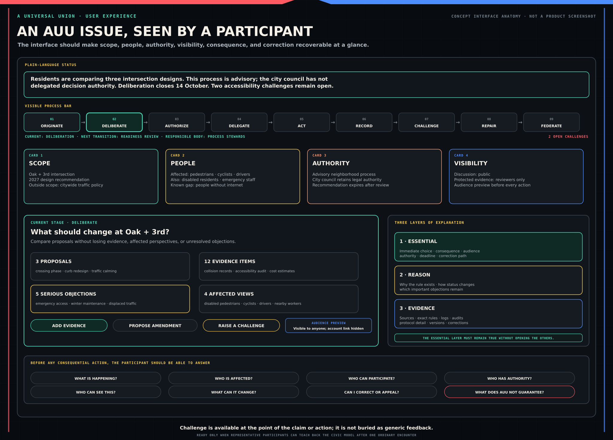

# A Universal Union: User Experience Requirements

**Document role:** This document defines what a person must be able to understand and do when using AUU. It does not prescribe a visual style or promise that the interface has been built.

## 1. The central usability requirement

AUU will fail if only experts can tell what its screens mean.

For every consequential action, a person should be able to answer:

1. **What is happening?**
2. **Who is affected?**
3. **Who can participate?**
4. **Who has authority, and where did it come from?**
5. **Who can see this action and its metadata?**
6. **What can this action change?**
7. **Can it be changed, withdrawn, challenged, or appealed?**
8. **What does AUU not guarantee?**

Those answers should not require reading a policy manual. The interface should show the essential answer first and provide evidence and detail on demand.

The objective is not merely task completion. It is informed task completion: the person forms an accurate enough model to act knowingly.

## 2. One visible civic cycle

AUU uses one recurring sequence:

> **originate → deliberate → authorize → delegate → act → record → challenge → repair → federate**

Not every process uses every stage. A survey may stop after deliberation. A collective may act without a formal vote. Federation may never be relevant. The interface must show which stages apply, which have happened, and what comes next.

### 2.1 The process bar

Every issue should have a compact process bar or equivalent summary. It should show:

- the current stage;
- completed and skipped stages;
- the rule that permits the next transition;
- the person or body responsible for that transition;
- important deadlines;
- unresolved challenges; and
- whether the process is advisory, binding within a stated scope, or only experimental.

Selecting a stage should reveal its record: inputs, rule, authority, result, dissent, and corrections. The process bar must not imply that a disputed or failed stage was completed successfully.

### 2.2 A plain-language status sentence

Every issue also needs a sentence a hurried reader can understand. For example:

> Residents are discussing three options. The school board has promised to consider the result but has not delegated decision authority to this process. Discussion closes 14 October. Two accessibility challenges remain open.

That sentence carries more civic meaning than a generic label such as *Active*.

## 3. Three layers of explanation

People need different depths at different moments. AUU should use progressive disclosure:

1. **Essential layer:** the decision, consequence, audience, authority, deadline, and path to correct a mistake.
2. **Reason layer:** why the rule exists, how the result is calculated, and which important objections remain.
3. **Evidence layer:** source material, formal definitions, protocol details, logs, audits, and version history.

The first layer must be truthful without the others. It cannot say “private” if the evidence layer reveals public metadata, or “your vote was counted” if the receipt proves only that a submission reached one server.

Experts should be able to reach the exact rule and evidence quickly. Less-prepared readers should not have to absorb those details before they can understand the immediate choice.

## 4. The four cards that travel with every issue

To reduce working-memory load, AUU should present the same four summaries in the same place throughout a process.

### 4.1 Scope card

The scope card answers:

- What question is being addressed?
- Which places, services, people, resources, and time period are included?
- What is explicitly outside scope?
- Who may change the scope?

### 4.2 People card

The people card distinguishes:

- people directly affected;
- participants;
- eligible decision-makers;
- advocates and representatives;
- delegates and office-holders;
- operators and moderators; and
- people known to be missing or underrepresented.

It must not imply that everyone affected is participating or that every participant consented to the outcome.

### 4.3 Authority card

The authority card states:

- whether the process is exploratory, advisory, internally binding, or recognized by a named external actor;
- the source and scope of any authority;
- the person or body that recognizes it;
- conditions and expiry;
- conflicts with other authority claims; and
- how authority can be challenged, revoked, or replaced.

The card should use verbs, not only institutional titles. “The council may spend up to £50,000 on this project” is clearer than “Council-authorized mandate.”

### 4.4 Visibility card

The visibility card states separately who can see:

- the action or content;
- the actor's public name or pseudonym;
- eligibility or membership proof;
- timestamps, device or network information, and other metadata;
- moderation and challenge records; and
- protected evidence.

The available modes are **public**, **participant- or member-visible**, **protected review**, and **private**. A setting such as “members only” must identify which members and whether operators, reviewers, credential issuers, or compelled third parties can also gain access.

Before a person posts, votes, delegates, joins, or reveals a credential, the interface should preview the actual audience in one short sentence.

The following conceptual view shows how status, process, the four cards, progressive explanation, current-stage work, action, and challenge remain visible around one issue.

## 5. Language rules for the interface

### 5.1 Name the action and consequence

Buttons and headings should describe the real action:

| Avoid | Prefer |
|---|---|
| Submit | Send this proposal for member review |
| Confirm | Cast this changeable ballot |
| Join | Request membership in River Ward Association |
| Verify | Prove you are eligible without showing your birth date |
| Finalize | Close discussion and begin the seven-day challenge period |
| Public | Visible to anyone, including search engines |

Shorter is not always clearer. The action label can remain compact if nearby text explains the consequence.

### 5.2 Explain a special term at first use

Use an ordinary phrase first, followed by the controlled term when it helps:

> Someone may pretend that organized or paid support is a spontaneous public movement. This is called **astroturfing**.

After that explanation, the shorter term can be used. The [glossary](GLOSSARY.md) provides project-wide meanings, but the interface should not force a person to leave a consequential flow to understand it.

### 5.3 Avoid false comfort

Do not use unqualified labels such as:

- anonymous;
- secure;
- verified;
- fair;
- unbiased;
- final;
- official;
- representative; or
- community-approved.

Replace them with the specific result. For example: “Your public comment uses the name RiverStone. The platform operator can link it to your account” or “This audit checked the published tally against the accepted encrypted ballots; it did not test coercion or voter-device compromise.”

### 5.4 Keep distinctions visible

The interface must not collapse:

- account access into personhood;
- identity into public name;
- membership into consent;
- participation into representation;
- preference into authorization;
- delegation into surrender of rights;
- a receipt into proof of a choice;
- a record into truth;
- popularity into legitimacy; or
- data exchange into transferred authority.

Where people commonly confuse two ideas, show the contrast at the decision point.

## 6. Key participant journeys

### 6.1 First arrival

A first-time visitor should be able to see, before creating an account:

- what AUU is and is not;
- a complete example of the civic cycle;
- what can be viewed without joining;
- what account creation reveals;
- which actions may require stronger eligibility evidence;
- available assisted, offline, low-bandwidth, and accessibility routes; and
- how to ask a question or report harm.

The visitor should not be asked to accept a long universal consent bundle. Necessary terms should be summarized and linked. Optional analytics, public profile fields, research participation, notifications, and credential connections require separate choices.

### 6.2 Account, pseudonym, and recovery

The account flow should separate four questions:

1. How will you regain access?
2. What, if anything, proves you are one eligible person for a particular process?
3. Which name or pseudonym will other participants see here?
4. Which parties can connect that presentation to other contexts?

Recovery must not be hidden until a crisis. The interface should help a person set up more than one safe route where feasible, explain provider dependence, and warn when losing a device or external account could remove access. Recovery actions that can transfer civic authority require delay, notice, challenge, and a record appropriate to the risk.

### 6.3 Starting an issue

The issue form should begin with ordinary questions:

- What is happening?
- Who may be affected?
- What decision or learning is needed?
- Who could act on it?
- What is already known?
- What is uncertain?
- Is there a deadline or immediate safety concern?

The interface may then help the author create a title, scope, evidence list, and affected-person map. Automated suggestions must remain editable and identified as suggestions. The author should see likely duplicates without being forced into a poorly matched existing issue.

An issue can begin before every affected person is known. Its record should show that the affected-person analysis is incomplete and invite correction.

### 6.4 Deliberating

A deliberation view should make it easy to find:

- the current question and scope;
- proposals and amendments;
- supporting and opposing reasons;
- evidence and its source;
- uncertainty and factual disputes;
- affected perspectives;
- areas of agreement and disagreement;
- moderator actions; and
- open challenges.

Chronological conversation may remain available, but it should not be the only structure. A reader returning after a week needs a change summary: what was added, corrected, merged, split, withdrawn, or challenged.

Automated summaries must link to source contributions and provide a visible correction path. When materially different summaries are defensible, show more than one. Do not label a summary “the community view” merely because a model produced one cluster or a majority endorsed it.

### 6.5 Polling and voting

Before participation, show a compact decision statement:

- the exact question and options;
- whether the action is a poll or an authority-bearing vote;
- eligibility and decision rule;
- authority and recognition;
- opening, closing, and change rules;
- privacy and metadata exposure;
- what the participant may verify;
- whether any receipt could reveal participation or choice to another person;
- recount, challenge, and remedy; and
- what happens after the result.

The ballot should not rely on color, position, memory, or expert vocabulary. Review screens must repeat the choice, consequence, change deadline, and visibility. A receipt must state exactly what it proves: submission, inclusion, tally process, delegation status, or a choice. It must never imply a stronger proof.

If AUU cannot provide the required combination of ballot secrecy, verifiability, accessibility, coercion resistance, and recovery for a proposed use, the interface should block that use rather than hide the gap in terms and conditions.

### 6.6 Delegating

The delegation flow should show:

- the person receiving power;
- topics, collectives, actions, and time period covered;
- whether onward delegation is allowed;
- how conflicts between delegations are resolved;
- what the delegate can see;
- current concentration of delegated power;
- how to revoke or override; and
- which actions already occurred and cannot simply be undone.

The default should be narrow, reviewable, and time-bounded. “Delegate all” must not be the easiest path. Revocation should be as easy to find as delegation, while still explaining any actions already taken under the mandate.

### 6.7 Acting and following through

A decision page should not end at a result. It should show:

- the authorized action;
- responsible people or bodies;
- resources and constraints;
- milestones and evidence;
- current status;
- deviations and reasons;
- people affected by implementation; and
- how to challenge failure, overreach, or unexpected harm.

Status labels should be specific: *not started*, *in progress*, *blocked*, *changed with authorization*, *changed without required authorization*, *completed with evidence*, *contested*, or *abandoned*. A dashboard must not turn a self-reported update into a verified fact.

### 6.8 Challenging and appealing

The challenge action must be available wherever a person can see the decision, authority claim, moderation action, record, analytic output, or implementation status being challenged. It need not always occupy a separate discussion lane, but it cannot be buried as generic feedback.

The challenge form should ask:

- What are you challenging?
- What kind of problem is it?
- How are you affected, or what public reason gives you standing?
- What evidence or reasoning supports the challenge?
- What immediate protection or repair is requested?
- Is protected handling needed?

After submission, show the responsible reviewer, public or protected visibility, response time, current state, reasoned response, appeal route, remedy, and record. Anti-flooding controls may slow abuse, but they must not silently remove a person's independent standing because that person did not join or support the original process.

### 6.9 Joining or configuring a collective

The collective page should show:

- what the collective is;
- whom or what it claims to represent;
- whether the claim is self-description, member authorization, legal office, or external recognition;
- membership rules;
- authority scopes;
- decision and challenge rules;
- operators, role-holders, and funders;
- visibility and roster protections;
- competing claims; and
- exit, succession, split, and dissolution rules.

Creating a collective configuration does not establish that the collective is legitimate or that it represents everyone named. The interface must say so at creation and on public claims.

## 7. Accessibility is part of legitimacy

The baseline for web content should be WCAG 2.2 AA, tested with both tools and people. That baseline is necessary but not sufficient. AUU should also test cognitive accessibility, plain language, assistive technologies, translation, low bandwidth, older devices, limited digital experience, and non-web participation.

### 7.1 Equivalent civic access

An alternative route is equivalent only if it provides comparable:

- information;
- privacy;
- ability to participate;
- time to respond;
- verification;
- challenge and appeal; and
- protection from dependence on a gatekeeper.

A staffed help desk can improve access, but a person should not have to reveal a protected political view to an assistant when independent participation could reasonably be provided.

### 7.2 Cognitive load

To help people maintain the model:

- keep the process bar and four issue cards consistent;
- break long tasks into reversible steps;
- show one primary question per screen;
- provide a short summary before detail;
- use concrete examples next to abstract rules;
- preserve entered work across interruptions;
- show change summaries for returning readers;
- avoid time pressure unless the process truly requires it;
- make help available without resetting the task; and
- offer a simplified explanation without withholding the exact rule.

### 7.3 Language and translation

The source language should be plain enough to translate reliably. Human review is required for consequential translations. The interface should identify the authoritative wording, translation status, material disagreements, and a way to report an error.

Glossaries should explain project-specific terms, not force every language to imitate English legal or technical structure. Examples must be reviewed for cultural assumptions and should not imply that one country's institutions are universal.

## 8. Privacy and safety at the point of action

Privacy settings belong next to the action they govern. A central settings page is not enough.

Before disclosure, the interface should explain:

- the immediate audience;
- foreseeable later audiences;
- retention and deletion limits;
- search, export, combination, and inference risks;
- the operator and relevant reviewers;
- whether a credential issuer or identity bridge learns about the interaction;
- practical limits created by law, screenshots, compromised devices, or other participants; and
- how to correct, withdraw, or challenge the record.

High-risk public actions should include an audience preview and a brief pause before publication. That pause must not become a manipulative warning designed to suppress lawful criticism.

Protected review screens need extra controls: purpose-bound access, least privilege, access records, safe workspaces, no unnecessary downloading, expiry, and a route to report reviewer misuse.

## 9. Attention, notifications, and discovery

AUU should help people spend attention deliberately, not maximize time on site.

Notifications should be grouped by civic importance:

1. **Action required:** a deadline, security event, authority change, or request for response.
2. **Material change:** a proposal, decision, challenge, correction, or implementation change relevant to the person.
3. **Optional update:** general activity and discovery.

The reason for each notification should be visible. People need topic, collective, urgency, channel, quiet-time, and digest controls. Safety-critical notices require carefully defined fallback routes; “we sent an email” is not proof the person received or understood it.

Discovery rankings should show why an item appears and allow chronological, local, affected-person, subscribed, and other meaningful views. Paid promotion, institutional sponsorship, suspected coordinated campaigns, and personalization must be identified. The system should not quietly decide that high engagement equals public importance.

## 10. Administrative and expert interfaces

Powerful interfaces require stronger explanation, records, and review—not less.

An administrator changing eligibility, visibility, moderation, decision, delegation, retention, or federation rules should see:

- the affected processes and people;
- the source of authority;
- a plain-language preview of the consequence;
- conflicts and unsafe states;
- required co-approval or waiting period;
- notification and migration effects;
- rollback limits; and
- the public or protected change record.

Bulk actions need samples, dry runs, reversible staging where possible, and explicit scope. Expert shortcuts must not bypass civic safeguards.

## 11. Error, uncertainty, and failure

Errors should tell the person:

- what did and did not happen;
- whether a civic action may have been recorded;
- how to verify state without repeating an action blindly;
- what information is safe to include in a support request;
- who is responsible; and
- what alternative route exists.

If the system is uncertain, it should say so. “We cannot yet confirm whether your ballot was included” is safer than either a false success or a generic error. Incident notices should distinguish confidentiality, integrity, availability, and authority effects in ordinary language.

The interface needs degraded modes for lost connectivity, delayed credentials, failed analytics, unavailable federation partners, and operator outages. A decorative offline screen is not a continuity plan.

## 12. Testing the experience

### 12.1 Representative research

Testing should include people who vary in:

- literacy and civic knowledge;
- disability and assistive technology;
- language;
- age and digital experience;
- device and connection quality;
- time available;
- trust in institutions;
- personal safety and exposure risk; and
- relationship to the issue, including affected nonparticipants.

Testing only contributors, civic-technology enthusiasts, or highly educated volunteers will hide the most consequential failures.

### 12.2 Teach-back tasks

After a consequential flow, ask a participant to explain it to another person. Can they accurately reconstruct:

- the question and scope;
- their own action;
- visibility;
- eligibility and authority;
- result and next step;
- uncertainty; and
- correction or challenge?

Do not turn this into a memory exam or a barrier to participation. The goal is to identify where the design produced a false model.

### 12.3 Release-blocking misunderstandings

A repeated or serious misunderstanding blocks the relevant use when it concerns:

- who can see a protected action;
- whether an action is a poll or binding vote;
- whether participation implies consent;
- what a receipt proves;
- whether a delegation is still active;
- who can act on a result;
- whether a summary is human, automated, or contested;
- whether a record can be changed or removed; or
- how to obtain protection, correction, challenge, or appeal.

Success rates should be reported by relevant participant group, not only as one average that can hide exclusion.

## 13. Content and interaction records

User-facing language is part of the governed system. Consequential text should have:

- a named owner;
- a controlled term source;
- version and effective date;
- readability and translation review;
- links to the underlying rule;
- known ambiguity or disagreement; and
- a correction history.

Reusable interface patterns should include the process bar, scope card, people card, authority card, visibility card, decision statement, audience preview, receipt explanation, challenge state, change summary, and assurance label. Consistency in these patterns helps people transfer learning from one issue to another.

## 14. Anti-patterns

AUU should reject designs that:

- hide authority behind a friendly community label;
- call an action anonymous when an operator or issuer can link it;
- use one click to bundle membership, consent, publicity, research, and notifications;
- present an automated synthesis as neutral fact;
- display a vote total without eligibility, rule, authority, and challenge information;
- use a public ledger as an excuse to publish harmful material or permanent personal data;
- make delegation prominent and revocation obscure;
- make challenge possible only through the actor being challenged;
- punish a person for using an accessible or offline route;
- use gamification to pressure civic action;
- treat more engagement as the goal regardless of comprehension or harm;
- imply that software recognition creates real-world legitimacy; or
- require the reader to remember rules that can be shown at the point of action.

## 15. Acceptance test

An AUU experience is not ready merely because people can navigate it. It is ready for a defined use only when representative intended participants can, after one ordinary encounter:

1. explain the issue and current stage;
2. distinguish affected people, participants, eligible decision-makers, delegates, operators, and recognizers;
3. identify the source and limit of authority;
4. understand what is visible to whom;
5. predict what their action can and cannot change;
6. find the record, disagreement, and uncertainty;
7. correct a mistake or challenge an abuse; and
8. state at least the most important thing AUU does not guarantee.

That is the user-experience expression of AUU's larger aim: not a new ruler, but a correctable way to rule together.
